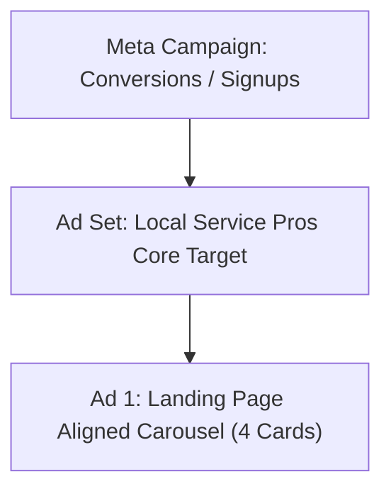

# ScanGo Meta Ads Campaign Plan: Local Services Focus (v2)

**Objective:** Scale registrations for ScanGo Invoice by targeting small local service businesses (contractors, plumbers, electricians, landscapers) using a benefit-driven **"Get Paid 3x Faster"** hook in a high-engagement Carousel format aligned perfectly with the landing page benefit badges.

---

## 📊 1. Budget & Structure Strategy (~$210/mo)

> [!WARNING]
> With a budget of ~$7.00/day ($210/month), you must **avoid budget fragmentation**. Splitting this budget across multiple campaigns or ad sets will cause the Meta algorithm to stay trapped in the "Learning Phase" forever and yield poor results.

### Simplified Meta Architecture
To maximize your budget, we will run **exactly one campaign** and **one ad set** focusing on a single, high-affinity core audience:



| Component | Setting / Target | Rationale |
| :--- | :--- | :--- |
| **Campaign Objective** | **Leads** or **Sales (Conversions)** | Optimize directly for *Complete Registration* (custom Pixel event). Do NOT use Traffic campaigns, as they deliver low-intent link-clicks. |
| **Bidding Strategy** | **Lowest Cost (Maximize conversions)** | Let Meta find the cheapest signups within your daily limit. |
| **Daily Budget** | **$7.00 / day** | Fits your ~$210/month target. |
| **Placements** | **Advantage+ Placements** | Allows Meta to distribute budget dynamically across Facebook Feed, Instagram Feed, Reels, and Stories to find the lowest CPC. |

---

## 🎯 2. Laser-Focused Audience Targeting

Since you are targeting **local service professionals**, we will combine demographic filters with specific business and platform behaviors to target owners who do their own billing on the road.

### Core Target: The "On-The-Road" Business Owner
- **Location:** Your target country (e.g., United States)
- **Age:** 25 - 55
- **Gender:** All
- **Detailed Targeting (Match ANY of the following):**
  - **Interests (Local Services):** `Plumber`, `Electrician`, `Landscaping`, `General contractor`, `Home improvement`, `Painting (spatial work)`, `Roofing`, `HVAC`.
  - **Interests (Business Tools):** `Invoice`, `Billing`, `QuickBooks`, `Receipt`, `Mobile payment`, `Square (payment service)`.
  - **Behaviors:** `Facebook Page Admins` (specifically "Business Page Admins" or "Retail & Service Page Admins").
- **Device Filter (Highly Recommended):** **Mobile Only** (Android & iOS).
  * *Why?* Local service pros are rarely at a desktop. They invoice from their trucks or directly at the job site immediately after completing the work.

---

## 🎨 3. Carousel Ad Storyboard: "Landing Page Aligned"

This 4-card carousel is designed to walk a busy contractor from **frustration** (waiting to get paid) to **resolution** (ScanGo's 1-click on-site billing and tracking tools).

### Overall Primary Text (Captions above the carousel)
> 🚚 **Done with the job but still waiting to get paid?**
>
> Stop spending your weekends chasing unpaid invoices and sorting through pockets of crumpled receipts. ScanGo Invoice lets plumbers, contractors, and local pros track their work and send professional invoices right from their phones in under 60 seconds.
>
> ⚡ **How it works:**
> 1️⃣ **Create Invoices in <60s:** Bill clients directly on-site while the work is fresh.
> 2️⃣ **Track Hours & Receipt Photos:** Log billable time and attach receipt photos on the go.
> 3️⃣ **1-Click Conversion:** Roll your logged time and expenses directly into a pre-filled invoice.
>
> 👉 Click below to start invoicing for free — no card required!

---

### Carousel Card Breakdown

```carousel
Card 1: Hook (The Pain Point)
Headline: "Still waiting on client checks?"
Description: "Get paid 3x faster with ScanGo."

CTA: Sign Up
<!-- slide -->
Card 2: Benefit 1 (60s Mobile Invoicing)
Headline: "Invoices under 60 seconds"
Description: "Create and send right from your phone."

CTA: Sign Up
<!-- slide -->
Card 3: Benefit 2 (On-the-go Tracking)
Headline: "Track hours & receipt photos"
Description: "Log time and upload receipts on-site."

CTA: Sign Up
<!-- slide -->
Card 4: Benefit 3 (1-Click Conversion & Trust)
Headline: "1-Click invoice conversion"
Description: "Join 1,000+ local service pros."

CTA: Sign Up
```

---

## ✍️ 4. Ad Copy Variations (For testing)

Meta allows you to input multiple headlines and primary texts. Use these high-converting variations to let Meta optimize the copy:

### Primary Text (Ad Body Copy)
1. **The Straight-to-Business Hook (Best for Contractors):**
   > *“You didn't get into business to do paperwork. Stop chasing invoices after a hard day's work. Generate professional invoices in 1-click on your phone, track project hours, log expenses with receipt photos, and get paid 3x faster. Sign up free today.”*
2. **The "Weekend Freedom" Hook (Psychological Leverage):**
   > *“Keep your weekends for yourself. No more writing invoices or sorting crumpled receipts on Sunday nights. With ScanGo, invoice your clients before you even start your truck. Secure card payments built right in. Try it 100% free.”*

### Carousel Card 1 Headlines
1. `Get Paid 3x Faster` (Direct benefit)
2. `Send Invoices on the Job` (Action-oriented)
3. `Plumbers & Contractors: Invoice in 60s` (Industry-specific)

---

## 📈 5. Landing Page Alignment & Conversion Tracking

To make this campaign succeed on a $7.00/day budget, your tracking and message match must be seamless:

### 1. Message Match
When the user clicks **"Sign Up"** on the carousel, they must land on a page that immediately reiterates the promise. Our newly optimized [LandingPage.vue](file:///C:/Users/curth/git/swift-invoice/src/components/LandingPage.vue) does this beautifully:
* **Ad Hook:** *"Get Paid 3x Faster"*
* **Landing Page Hero:** *"Turn Tracked Work into Paid Invoices in One Click"* accompanied by the symmetric visual Google & Email CTAs.
* **Landing Page Mobile Performance:** The deferred GIF loading and compact glassmorphic benefits badges we implemented guarantee that users coming from the Meta in-app browser (which is notoriously slow) will experience near-instant load times, lowering bounce rates dramatically.

### 2. Meta Pixel Integration
Ensure the Meta Pixel triggers the **`CompleteRegistration`** event when a user successfully signs up. 
* Target the custom event inside your Vue router or on a successful auth callback.
* If a lead signs up via Google OAuth or Email, fire:
  ```javascript
  fbq('track', 'CompleteRegistration');
  ```
  This signals back to the Meta Ads manager that the $7.00/day budget successfully produced a customer, allowing the algorithm to optimize and target similar local service providers.

---

## 🛠️ 6. Weekly Optimization Guide for $7/day Campaigns

> [!TIP]
> **Do not touch the campaign for the first 7 days.** At $7/day, it takes time for Meta to gather impressions. Making frequent changes will reset the learning phase.

- **Weekly Check:**
  - Check the **Cost Per Lead (CPL)**. If it is under $5.00, your campaign is performing exceptionally well for your budget.
  - Review placement metrics. If Instagram Reels is performing significantly better than Facebook Desktop Feed, let Meta's Advantage+ placements continue handling it automatically.
- **Monthly Check:**
  - If your Click-Through-Rate (CTR) drops below **1.2%**, refresh the carousel visual prompts or swap Card 1's headline to one of the variations.
  - Exclude existing signups by uploading your active user email list as a **Custom Audience** and excluding them from targeting. This ensures you never pay for clicks from people who already use ScanGo.
